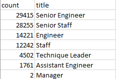
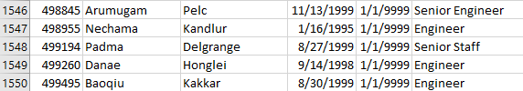
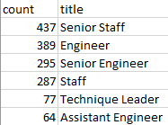
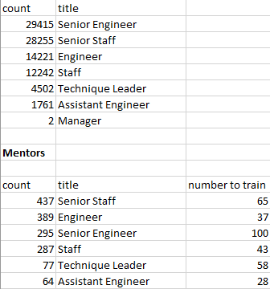

# Overview of Analysis

A request was made to determine the number of retiring employees per title and employees eligable to participate in a mentorship program. This is needed to head of an upcoming "silver tsunami" that sees a large portion of the workforce retiring all at once.

## Results

There are an exceptionally large number of employees are eligable across all departments.

1. 90,398 employees are elgible for retirement 
    
2. Only 1,549 empoloyees are eligibile for the mentorship program 
    
3. Of those 1,549, none are managers 
    
4. HP is not fully prepared for the "silver tsunami"

## Summary

Below is a breakdown of the number of roles that need to be filled:

 Below is a breakdown of the number of eligible employees for them mentorship program based on title:
 

 Across the organization, there are not enough eligigle employees to mentor staff to replace the outgoing staff. THis can be shown by calculating the number of employees a mentor would need to train using data from the above two tables:

 

 Depeding on the amount of time it takes to train and the number of people who enter the mentorship program, it may be impossible to train enough people in time. Also, it should be noted that no managers are eligibile for the mentioship program.

 ## Conclusion

 HP is not fully prepared for the "silver tsunami". They either need to adjust thier criteria for employees who can enter the mentioship program or hire seasoned professionals who can fill the outgoing employees.
